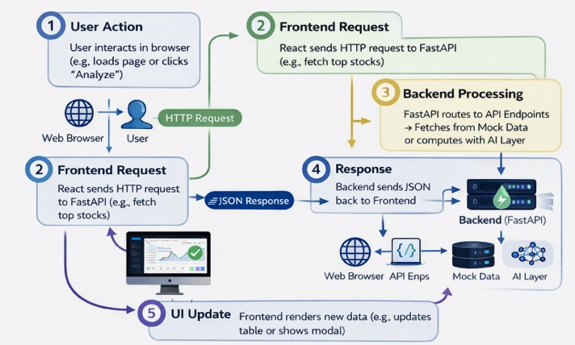

# RealTicker - AI-Powered Stock Insights Platform

RealTicker is a modern, full-stack web application. It provides users with real-time stock insights, including top 10 stocks, historical price charts, and AI-generated investment analysis using machine learning. The app features a responsive React frontend with Material-UI, a FastAPI backend for data handling, and HuggingFace's GPT-2 for AI analysis.

## Features
- **Stock Table**: View top 10 stocks with search, sorting (by change % and volume), and clickable rows for details.
- **Interactive Charts**: 6-month price history visualized with area charts (using Recharts).
- **Metrics Dashboard**: Key stats like current price, change %, and volume in centered, uniform cards.
- **AI Analysis**: Generate trend, risk level, and investment suggestions via a modal popup.
- **Modern UI**: Dark/light theme toggle, gradients, animations, skeleton loaders, and toast notifications.

## Tech Stack
- **Frontend**: React.js, Material-UI (MUI), Recharts, React Router, Axios, React Hot Toast.
- **Backend**: Python, FastAPI, HuggingFace Transformers (GPT-2).
- **Data**: Mock stock data 

## Setup Steps

Follow these detailed steps to set up and run RealTicker locally. Ensure you have the prerequisites installed. If you encounter errors, check the troubleshooting section below.

### Prerequisites
- **Node.js (v14 or higher)**: Download from [nodejs.org](https://nodejs.org). Install and verify with `node --version` (should show v14+).
- **npm (comes with Node.js)**: Verify with `npm --version` (should show 6+).
- **Python (v3.8 or higher)**: Download from [python.org](https://python.org). Install and verify with `python --version` or `python3 --version` (should show 3.8+).
- **Git**: Download from [git-scm.com](https://git-scm.com). Install and verify with `git --version` (should show a version number).
- **Operating System**: Windows, macOS, or Linux (steps are similar across platforms).

### Step 1: Clone the Repository
1. Open a terminal (Command Prompt on Windows, Terminal on macOS/Linux).
2. Navigate to a folder where you want to clone the repo (e.g., `cd Desktop`).
3. Run: `git clone https://github.com/yourusername/realticker.git` (replace `yourusername` with your GitHub username).
4. Wait for the download to complete. You should see a new folder named `realticker`.
5. Navigate into it: `cd realticker`.
6. Verify: Run `ls` (Linux/macOS) or `dir` (Windows). You should see `backend/`, `frontend/`, and `README.md`.

### Step 2: Set Up the Backend
1. In the terminal, navigate to the backend folder: `cd backend`.
2. Install Python dependencies: `pip install -r requirements.txt`.
   - This installs FastAPI, Uvicorn, Transformers, Torch, and Pydantic.
   - It may take 1-2 minutes; ignore warnings about model downloads.
3. Verify installation: Run `python -c "import fastapi; print('FastAPI installed')"` (should print "FastAPI installed" without errors).
4. Start the backend server: `uvicorn main:app --reload`.
   - The server will start on `http://127.0.0.1:8000`.
   - You should see "Uvicorn running on http://127.0.0.1:8000" and "Application startup complete."
   - Do not close this terminal—keep the server running.
5. Test the backend: Open a browser and go to `http://127.0.0.1:8000/docs`. You should see FastAPI's interactive API documentation.

### Step 3: Set Up the Frontend
1. Open a **new terminal window** (don't close the backend terminal).
2. Navigate to the frontend folder: `cd realticker/frontend` (from the project root).
3. Install Node.js dependencies: `npm install`.
   - This installs React, MUI, Recharts, Axios, and other packages.
   - It may take 2-3 minutes.
4. Verify installation: Run `npm list react` (should show React version without errors).
5. Start the frontend development server: `npm start`.
   - The app will open in your browser at `http://localhost:3000`.
   - You should see the RealTicker stock table loading.
   - Do not close this terminal—keep the server running.

### Step 4: Run and Test the Full Application
1. Ensure both backend (`http://127.0.0.1:8000`) and frontend (`http://localhost:3000`) are running in separate terminals.
2. In the browser at `http://localhost:3000`:
   - View the top 10 stocks table.
   - Use the search bar to filter (e.g., type "Apple").
   - Click sort arrows next to "Change %" or "Volume" to reorder.
   - Click a stock row (e.g., AAPL) to go to the details page.
   - On the details page, view the chart, metrics cards, and click "Analyze with AI" for insights in a modal.
3. Test interactions: Toggle dark/light theme, resize the window for responsiveness.
4. Verify AI: The analysis should show varied results (e.g., trend, risk, action) based on stock data.

### Troubleshooting
- **Git Clone Fails**: Ensure the repo URL is correct and public. If authentication errors, use a personal access token (see GitHub docs).
- **Pip/Npm Not Found**: Reinstall Python/Node.js. On Windows, add to PATH during installation.
- **Port Conflicts**: If ports 3000 or 8000 are in use, stop other apps or change ports (e.g., `npm start -- --port 3001` for frontend).
- **Dependencies Errors**: Run `pip install --upgrade pip` or `npm cache clean --force` then reinstall.
- **CORS Errors**: Ensure backend is running; CORS is enabled in `main.py`.
- **LLM Loading Slow**: First run downloads GPT-2 model; wait 1-2 minutes.
- **App Not Loading**: Check browser console (F12) for errors. Restart servers.
  
### Architecture 
1- **Frontend**: Handles UI rendering, state management, and user interactions. Fetches data from backend via REST APIs.
2- **Backend**: Serves data, processes requests, and integrates AI. Uses mock data for compliance; scalable to real APIs.
3- **Data Flow**: User actions trigger API calls → Backend processes → AI generates analysis → Frontend displays results.
4- **Security**: CORS enabled, input validation, no sensitive data exposed. 

### LLM Used
- **Model**: HuggingFace Transformers GPT-2 (open-source, lightweight).
- **Purpose**: Generates natural language responses for stock analysis based on computed metrics (trend, risk, action).
- **Integration**: In `backend/llm_analyzer.py`, computes trend from price changes, risk from volatility, and action logic. GPT-2 enhances with text generation but prioritizes data-driven results for accuracy.
- **Why GPT-2?**: Free, fast, and compliant with hackathon requirements. Easily upgradable to GPT-3.5 or Llama for production.
- **Prompt Example**: "Analyze the following 6 months stock price data: [prices]. Identify trend, volatility, and provide investment guidance for a beginner."
- **Output**: Trend (Upward/Downward/Sideways), Risk Level (Low/Medium/High), Suggested Action (e.g., "Long-term investment").

